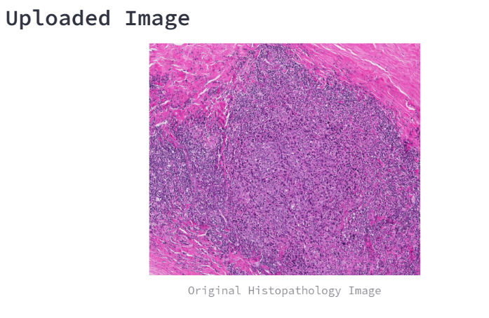
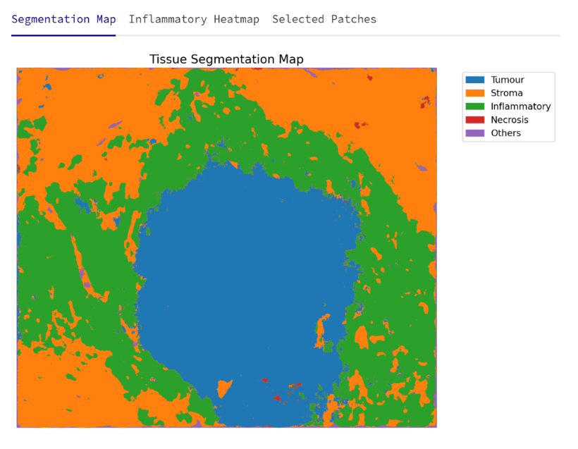
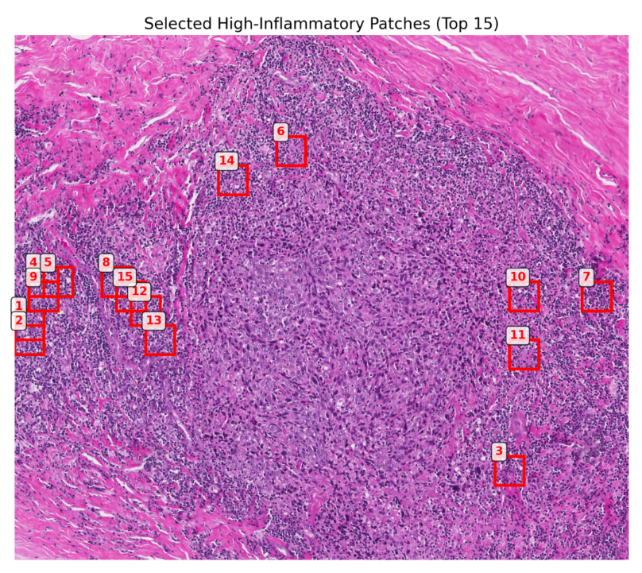
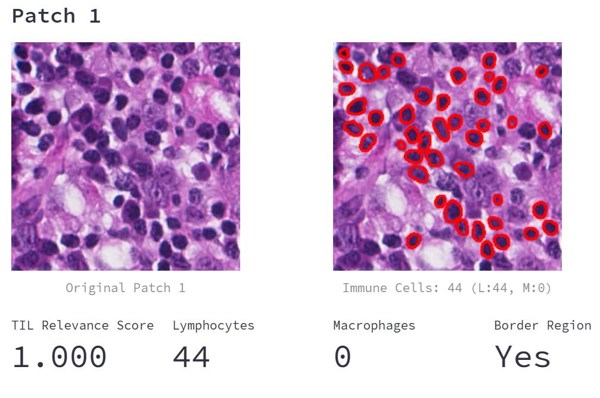

# Histopathology TIL Analysis

An interactive **Streamlit app** for analyzing tumor-infiltrating lymphocytes (TILs) in histopathology images.  
Built with **[TIAToolbox](https://tia-toolbox.readthedocs.io/)**, PyTorch, and OpenCV.

---

## Features
- **Tissue segmentation** and extraction of patches/ROIs  
- **Nucleus segmentation** on pre-selected or manually selected ROIs to identify lymphocytes and macrophages
- **Manual ROI selection** via interactive canvas  
- Overlayed **visualizations** for patches and nuclei  

---

## Installation
```bash
git clone https://github.com/AthSre13/histopathology-til-analysis.git
cd histopathology-til-analysis
pip install -r requirements.txt
```

## Usage
```bash
streamlit run app.py
```
## Examples

1. **Upload an Image**
   

2. **Tissue Segmentation and Patch selection**
   
   

4. **Nucleus Segmentation**
   


